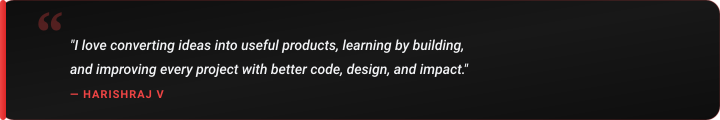

  

  

  
  &nbsp;
  
  &nbsp;
  
  &nbsp;
  

  

<h2 align="center"> About Me</h2>

  

  

  Hey! I'm <b>Harishraj V</b>, a passionate <b>Computer Science Engineering student &amp; developer</b> at <b>Kongu Engineering College</b> (Batch 2024–2028), based in Erode, India. 
  I specialize in architecting scalable <b>Full-Stack web applications</b>, building intelligent <b>AI/ML solutions</b>, crafting cross-platform <b>Flutter mobile apps</b>, and exploring <b>Cybersecurity</b> to solve practical real-world problems.

  
  &nbsp;
  
  &nbsp;
  

  <b>Let's Discuss:</b> Java, Python, C++, JavaScript, React, Node.js, AI/ML, System Architecture &amp; Git Workflows. 
  <b>Philosophy:</b> <i>"I love converting ideas into useful products, learning by building, and improving every project with better code, design, and impact!"</i>

<table width="100%" border="0" align="center">
  <tr>
    <td width="50%" align="center" style="padding: 12px;">
      <h4> Flagship Project</h4>
      

        <a href="https://hackerrank-orchestrate-sept-edition.vercel.app/" target="_blank">
          <b>Buy-or-Wait AI Agent</b>
        </a> 
        AI-Powered Shopping Decision Assistant
      

    </td>
    <td width="50%" align="center" style="padding: 12px;">
      <h4> Active Deep Dives</h4>
      

        <b>AI/ML &amp; Full-Stack Architecture</b> 
        React Ecosystem, Node.js &amp; Machine Learning
      

    </td>
  </tr>
  <tr>
    <td width="50%" align="center" style="padding: 12px;">
      <h4> Mobile &amp; Security</h4>
      

        <b>Flutter Apps &amp; Cybersecurity</b> 
        Cross-Platform &amp; Secure Systems
      

    </td>
    <td width="50%" align="center" style="padding: 12px;">
      <h4> Collaboration</h4>
      

        <b>AI, Web &amp; Mobile Products</b> 
        Open to exciting new projects &amp; hackathons
      

    </td>
  </tr>
</table>

<h2 align="center"> Featured Project Spotlight</h2>

<table width="100%" border="0" align="center">
  <tr>
    <td align="center" style="padding: 18px;">
      <h3> Buy-or-Wait AI Agent</h3>
      

        <i>An AI-powered shopping decision assistant built for HackerRank Orchestrate that analyzes product, price trends, and event data in real time to recommend whether to buy now or wait for better deals.</i>
      

       
      

        
        &nbsp;&nbsp;
        
      

    </td>
  </tr>
</table>

<h2 align="center"> LeetCode Problem Solving</h2>

  <i>Live real-time tracker of coding challenges &amp; algorithmic problem-solving milestones.</i>

  

  
  &nbsp;&nbsp;
  

<h2 align="center"> Tech Stack &amp; Skills</h2>

  

  
  &nbsp;
  
  &nbsp;
  

<h2 align="center"> GitHub Analytics &amp; Activity</h2>

  
  &nbsp;&nbsp;
  

  

  

<h2 align="center"> Let's Connect &amp; Collaborate</h2>

  <i>Whether you want to discuss AI/ML architectures, Full-Stack ideas, open-source projects, or just say hello — my inbox is always open!</i>

  
  &nbsp;&nbsp;
  
  &nbsp;&nbsp;
  
  &nbsp;&nbsp;
  

  

